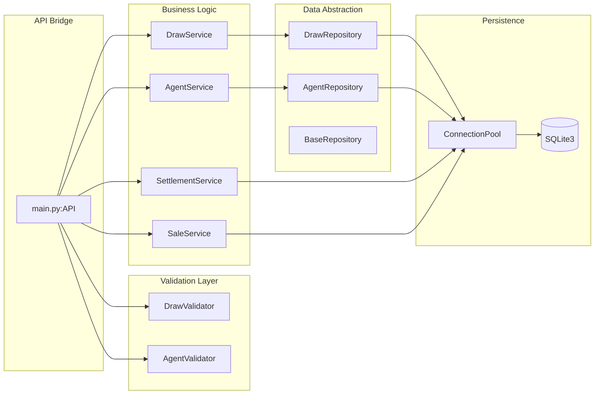

# Backend Service Architecture

The backend follows a **DDD-lite** (Domain-Driven Design) pattern, where logic is separated into discrete domain services.

### Key Components
- **API Bridge (`main.py`):** Acts as the controller. It instantiates the graph and handles exception translation for the frontend.
- **Service Layer:** Responsible for domain constraints (e.g., "only one open draw"). It coordinates multiple repositories if needed.
- **Repository Layer:** Encapsulates raw SQL queries. It ensures that data returned to services is in a standard dictionary format.
- **Connection Pool:** Manages thread-local SQLite connections to prevent locking issues in the pywebview environment.
