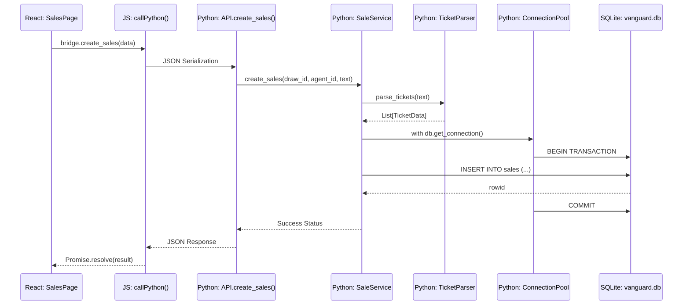

# Request Lifecycle & Data Flow

This diagram traces a typical "Create Sale" request from the UI to the Database.

### Data Integrity Measures
1. **At-Source Validation:** Input text is parsed and validated by the `TicketParser` utility before any DB operations occur.
2. **Transaction Integrity:** All writes use Python's `with` context manager on the connection pool, ensuring automatic COMMIT/ROLLBACK.
3. **Thread Safety:** The `ConnectionPool` ensures that pywebview's concurrent JS execution threads do not collide on a single SQLite handle.
