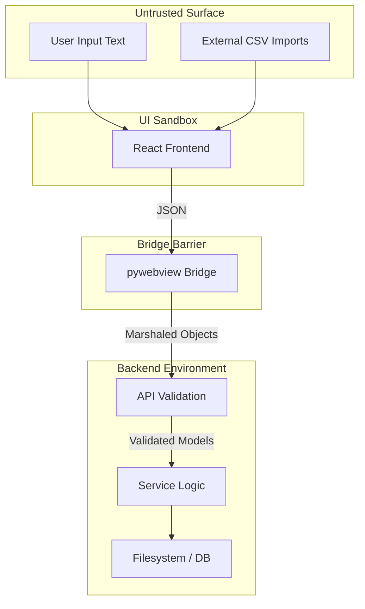

# Security & Trust Boundaries

Vanguard-3D is designed as a **Trusted Local Application**.

### Security Posture
1. **Marshaling Boundary:** No raw strings from the UI are used directly in SQL queries. Data is marshaled through Pydantic models (validation layer) or parameterized SQL (persistence layer).
2. **Local Execution:** The app does not expose a network port (except for the Vite dev server during development). In production, it runs as a closed executable.
3. **No Dynamic Code:** No `eval()` or dynamic code execution in either the JS or Python layers.
4. **Data Isolation:** All operational data is stored in the local `vanguard.db` file.
