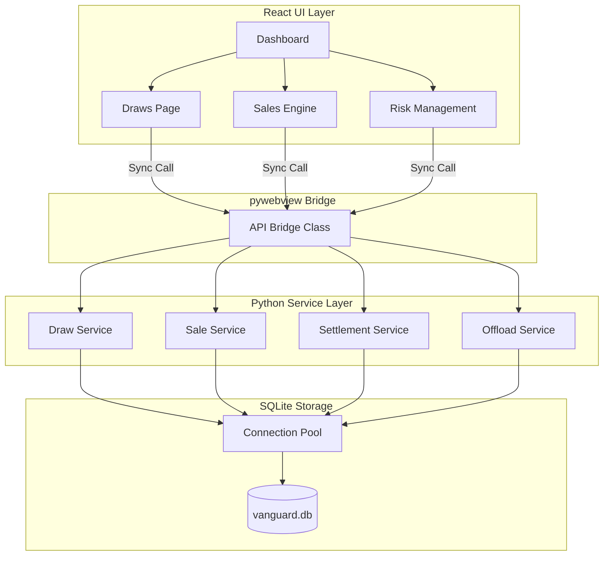

# System Overview Architecture

### Architectural Principles
1. **Bridge-Only IO:** All frontend-to-backend communication must pass through the `API` class in `main.py`. No direct filesystem or network access from the UI.
2. **Synchronous Execution:** Bridge calls are synchronous by default to simplify state management in the local context.
3. **Repository Abstraction:** Services do not execute SQL. They delegate data persistence to specialized Repositories or the Connection Pool.
4. **Local-First Design:** Optimized for single-user desktop usage with zero external server dependencies.
